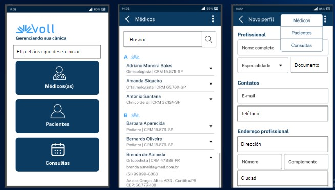
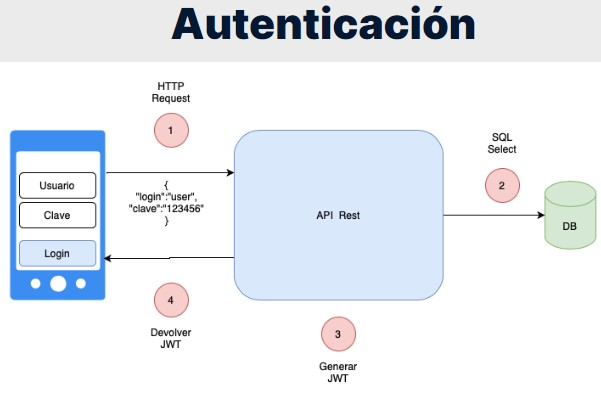
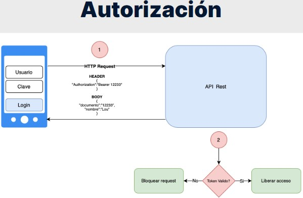

<h1 align="center"> Curso de Spring Boot 3: aplique las mejores prácticas y proteja una API Rest para una Clinica en Java</h1>

## Índice

* [Descripción del proyecto](#descripción-del-proyecto)
* [Tecnologías utilizadas](#tecnologías-utilizadas)
* [Desarrollo del proyecto](#Desarrollo)
* [Estado del proyecto](#estado-del-proyecto)

* [Características y demostración del Proyecto](#características-y-demostracion-Proyecto)

* [Acceso al proyecto](#acceso-proyecto)

* [Personas Contribuyentes](#personas-contribuyentes)

* [Licencia](#licencia)

* [Conclusión](#conclusión)

# Descripción del proyecto
# Curso de Spring Boot 3: aplique las mejores prácticas y proteja una API Rest
- 01 - Aprenda buenas practicas en diseño de API
- 02 - Aprenda fundamentos basicos de autenticación y autorización
- 03 - Aprenda a retornar codigos de error HTTP
- 04 - Aprenda fundamentos de Spring Security
	
### Proyecto de una Clinica Medica.
Clínica médica - Nuestra Voll clinic. En una clínica médica intervienen muchas cosas: pacientes, doctores, consultas, historias clínicas, etc.
y hay interacciones interesantes entre estos, por ejemplo, un paciente puede tener muchos doctores así como un doctor puede tener muchos pacientes.

Este tipo de relaciones y mapeamientos lo vamos a ver con Hybernate, por ejemplo. Podemos listar las historias clínicas, podemos listar los pacientes, 
podemos registrar nuevos pacientes, etc.




# Tecnologías utilizadas
- Tecnologias
	- Spring Boot 3
	- Java 17
	- Lombok: (herramienta para ayudar a reducir codigo, autogenera getter and setters, constructorses, etc).
	- MySQL/Flyway: (Flyway es un gestor de base de datos a nivel de la estructura y las tablas, declarar tus tablas como Scribd de SQL y
	  el motor de Flyway lo ejecuta y va a crear tu estructura de datos en MySQL de tal forma que es mantenible en el futuro,
	  es versionable y bueno puedes habilitar colaboración entre muchos desarrolladores.)
	- JPA/Hibernate: (JPA es la especificación de Java para lo que es persistencia y Hibernate es la implementación de esta especificación.)
	- Maven: (Maven es un gestor de dependencias, al igual que Gradle. Con esto tú declaras tus dependencias en el archivo pom.xml,
	  y puedes controlar mejor las versiones, actualizar y no tienes que necesariamente tener el archivo jar y pegarlo en tu proyecto.)
	- Insomnia: (Para probar nuestra API).

### Reglas de Negocio: Requerimientos

#### Request POST - Registrar Medicos
- Registrar médico con los siguientes datos:
```json
{
	"nombre": "Gerson Ep",
	"email": "Gerson.ep@voll.med",
	"documento":"881114",
	"telefono":"51656222",
	"especialidad": "ORTOPEDIA",
	"direccion":{
		"calle": "calle 6",
		"distrito": "distrito 6",
		"ciudad": "Lima",
		"numero": "1",
		"complemento": "e"
	}
}
```

#### Request GET - Produciendo Datos
- Consideraciones:
  - Informacion Requerida del medico: Nombre, Especialidad, Documento y Email.
  - Reglas de negocio: Ordenado ascendentemente, paginado, maximo 10 registros por paginas.

#### Request PUT - Actualizacion de Médicos
- Se solicita:
  - Informacion permitida para actualizacion: Nombre, Documento y Direccion.
  - Reglas de negocio: No permitir actualizar email, especialidad y documento.

#### Request DELETE - Exclusion de Médicos
- Reglas de Negocio:
  - El registro no debe ser borrado de la base de datos.
  - El listado debe retornar solo médicos activos.
- Los medicos no deben ser borrados de la BD, por lo que se realizar un delete logico. Se quiere que el médico quede desactivado a nivel de BD, por lo que no se debe eliminar, para resolverlo
debemos crear un campo flag(bandera) llamado activo en la tabla medico, al instanciarse cada medico en activo sera = 1, al eliminar el medico activo será = 0, al hacer el listado solo se retornarán los medicos
activos donde Activo es = 1. Y asi los registro medicos no se eliminarán de la BD. Ya que obviamente siempre es bueno mantener un histórico, qué médicos han trabajado en la clinica.

# Desarrollo del proyecto
* Generando proyecto con Spring Initializr. https://start.spring.io/


- Revisar y Descargar Codigo del Proyecto Anterior -  API Rest Clinica:
  - https://github.com/alura-es-cursos/1952-spring-boot-3-rest-api/tree/clase-5
  - https://github.com/alura-cursos/2770-spring-boot/tree/projeto_inicial
  - https://github.com/Gerson121295/SpringBoot3DesarrollarAPIRestJavaClinica
  

# Curso de Spring Boot 3: Aplique las mejores prácticas y proteja una API Rest

## 01 - Aprenda buenas practicas en diseño de API

### Para saber más: códigos de protocolo HTTP
- El protocolo HTTP (Hypertext Transfer Protocol, RFC 2616) es el protocolo encargado de realizar la comunicación entre el cliente, que suele ser un navegador, y el servidor. De esta forma, para cada “solicitud” realizada por el cliente, el servidor responde sí tuvo éxito o no. Si no tiene éxito, la mayoría de las veces, la respuesta del servidor será una secuencia numérica acompañada de un mensaje. Si no sabemos qué significa el código de respuesta, difícilmente sabremos cuál es el problema, por eso es muy importante saber qué son los códigos HTTP y qué significan.

#### Categoría de código
Los códigos HTTP (o HTTPS) tienen tres dígitos, y el primer dígito representa la clasificación dentro de las cinco categorías posibles.

- 1XX: Informativo: la solicitud fue aceptada o el proceso aún está en curso;
- 2XX: Confirmación: la acción se completó o se comprendió;
- 3XX: Redirección: indica que se debe hacer o se debió hacer algo más para completar la solicitud;
- 4XX: Error del cliente: indica que la solicitud no se puede completar o contiene una sintaxis incorrecta;
- 5XX: Error del servidor: el servidor falló al concluir la solicitud.

##### Principales códigos de error.
Como se mencionó anteriormente, conocer los principales códigos de error HTTP lo ayudará a identificar problemas en sus aplicaciones, además de permitirle comprender mejor la comunicación de su navegador con el servidor de la aplicación a la que intenta acceder.

###### Error 403
El código 403 es el error "Prohibido". Significa que el servidor entendió la solicitud del cliente, pero se niega a procesarla, ya que el cliente no está autorizado para hacerlo.

###### Error 404
Cuando ingresa una URL y recibe un mensaje de Error 404, significa que la URL no lo llevó a ninguna parte. Puede ser que la aplicación ya no exista, que la URL haya cambiado o que haya ingresado una URL incorrecta.

###### Error 500
Es un error menos común, pero aparece de vez en cuando. Este error significa que hay un problema con una de las bases que hace que se ejecute una aplicación. Básicamente, este error puede estar en el servidor que mantiene la aplicación en línea o en la comunicación con el sistema de archivos, que proporciona la infraestructura para la aplicación.

###### Error 503
El error 503 significa que el servicio al que se accede no está disponible temporalmente. Las causas comunes son un servidor que está fuera de servicio por mantenimiento o sobrecargado. Los ataques maliciosos como DDoS causan mucho este problema.

###### Un consejo final:
Difícilmente podemos guardar en nuestra cabeza lo que significa cada código, por lo que hay sitios web en Internet que tienen todos los códigos y significados para que podamos consultar cuando sea necesario. Hay dos sitios muy conocidos que usan los desarrolladores, uno para cada preferencia: 
- Si te gustan los gatos, puedes usar HTTP Cats; https://http.cat/
- Si prefieres perros, usa HTTP Dogs. https://http.dog/

##### implementar ResponseEntity para las funcionalidades del CRUD de los pacientes.
- Cambiar todos los métodos de la clase PacienteController para que devuelvan el objeto ResponseEntity, de la misma manera que se demostró en clase para la clase MedicoController:
```java
@PostMapping
@Transactional
public ResponseEntity registrar(@RequestBody @Valid DatosRegistroPaciente datos, UriComponentsBuilder uriBuilder) {
    var paciente = new Paciente(datos);
    repository.save(paciente);

    var uri = uriBuilder.path("/pacientes/{id}").buildAndExpand(paciente.getId()).toUri();
    return ResponseEntity.created(uri).body(new DatosDetalladoPaciente(paciente));
}

@GetMapping
public ResponseEntity<Page<DatosListadoPaciente>> listar(@PageableDefault(size = 10, sort = {"nombre"}) Pageable paginacion) {
    var page = repository.findAllByAtivoTrue(paginacion).map(DatosListadoPaciente::new);
    return ResponseEntity.ok(page);
}

@PutMapping
@Transactional
public ResponseEntity actualizar(@RequestBody @Valid DatosActualizacionPaciente datos) {
    var paciente = repository.getReferenceById(datos.id());
    paciente.actualizarInformacion(datos);

    return ResponseEntity.ok(new DatosDetalladoPaciente(paciente));
}

@DeleteMapping("/{id}")
@Transactional
public ResponseEntity eliminar(@PathVariable Long id) {
    var paciente = repository.getReferenceById(id);
    paciente.eliminar();

    return ResponseEntity.noContent().build();
}
```
- Crear un método más en este Controller, que se encargará de devolver los datos de un paciente:
```java 
@GetMapping("/{id}")
public ResponseEntity detallar(@PathVariable Long id) {
    var paciente = repository.getReferenceById(id);
    return ResponseEntity.ok(new DatosDetalladoPaciente(paciente));
}
```
- Crear el DTO DatosDetalladoPaciente:
```java 
 public record DatosDetalladoPaciente(String nombre, String email, String telefono, String documentoIdentidad, Direccion direccion) {
	public DatosDetalladoPaciente(Paciente paciente) {
		this(paciente.getNombre(), paciente.getEmail(), paciente.getTelefono(), paciente.getDocumentoIdentidad(), paciente.getDireccion());
	}
} 
```
## 02 - Tratando Errores
##### Spring boot Properties
- Sitio web para configuraciones de Spring boot. Buscar en google el sitio Spring boot properties luego server Properties.
  - #Spring boot Properties --> Server Properties -> server.error.include-stacktrace

- server.error.include-stacktrace = never, Se agrega en el archivo application.properties,  para evitar que el stacktracer de la excepción sea devuelto en el cuerpo de la respuesta, para evitar mostrar el StackTrages en los logs ya que representa problemas de seguridad al mostrar demasiada informacion.
- El archivo application.properties sirve para hacer configuraciones en el proyecto.

### personalización de mensajes de error
- Bean Validation tiene un mensaje de error para cada una de sus anotaciones. Por ejemplo, cuando la validación falla en algún atributo anotado con @NotBlank, el mensaje de error será: must not be blank.
- Estos mensajes de error no se definieron en la aplicación, ya que son mensajes de error estándar de Bean Validation. Sin embargo, si lo desea, puede personalizar dichos mensajes.
- Una de las formas de personalizar los mensajes de error es agregar el atributo del mensaje a las anotaciones de validación:

```java
public record DatosCadastroMedico(
    @NotBlank(message = "Nombre es obligatorio")
    String nombre,

    @NotBlank(message = "Email es obligatorio")
    @Email(message = "Formato de email es inválido")
    String email,

    @NotBlank(message = "Teléfono es obligatorio")
    String telefono,

    @NotBlank(message = "CRM es obligatorio")
    @Pattern(regexp = "\\d{4,6}", message = "Formato do CRM es inválido")
    String crm,

    @NotNull(message = "Especialidad es obligatorio")
    Especialidad especialidad,

    @NotNull(message = "Datos de dirección son obligatorios")
    @Valid DatosDireccion direccion) {}
```

- Otra forma es aislar los mensajes en un archivo de propiedades, que debe tener el nombre ValidationMessages.properties y estar creado en el directorio src/main/resources:
```properties
nombre.obligatorio=El nombre es obligatorio
email.obligatorio=Correo electrónico requerido
email.invalido=El formato del correo electrónico no es válido
phone.obligatorio=Teléfono requerido
crm.obligatorio=CRM es obligatorio
crm.invalido=El formato CRM no es válido
especialidad.obligatorio=La especialidad es obligatoria
address.obligatorio=Los datos de dirección son obligatorios
```
- Y, en las anotaciones, indicar la clave de las propiedades por el propio atributo message, delimitando con los caracteres { e }:
```java
public record DatosRegistroMedico(
    @NotBlank(message = "{nombre.obligatorio}")
    String nombre,

    @NotBlank(message = "{email.obligatorio}")
    @Email(message = "{email.invalido}")
    String email,

    @NotBlank(message = "{telefono.obligatorio}")
    String telefono,

    @NotBlank(message = "{crm.obligatorio}")
    @Pattern(regexp = "\\d{4,6}", message = "{crm.invalido}")
    String crm,

    @NotNull(message = "{especialidad.obligatorio}")
    Especialidad especialidad,

    @NotNull(message = "{direccion.obligatorio}")
    @Valid DatosDireccion direccion) {}
```

## 03 - Spring Security
### Autenticación y Autorización
Autenticación se puede resumir como el proceso mediante el cual tú aseguras que eres la persona que dice ser.
- Un ejemplo claro. Supongamos que yo estoy yendo al aeropuerto y yo deseo viajar a Estados Unidos. Entonces lo primero que yo hago cuando voy al aeropuerto es autenticarme con el counter que está en el aeropuerto. En este caso, ¿cómo me voy a autenticar? Con mi pasaporte. Mi pasaporte es mi credencial que me va a dar acceso a la sala de embarque del aeropuerto.
-  Tu usuario y tu clave son las credenciales que definen que tú en efecto eres quien dice ser.

- La autenticación es el proceso mediante el cual tú haces un request o post hacia algún API Rest que en este caso va a ser nuestra clínica médica con tu login, con tu user y con tu clave que ya tienes guardada en la base datos.
  El API va a buscar en la base de datos a ver si tienes tus credenciales guardadas y si es que es así, él te va a generar un JSON web token,
  Y finalmente una vez que el backend, que API Rest genera tu JSON web token devuelven el JSON web token a la aplicación cliente y de esta forma la aplicación cliente tiene que enviar ese token como llave para el siguiente paso, que es la autorización.

- Un JSON web token es un simple token o un string, es una serie caracteres alfanuméricos que están encriptados con algún algoritmo y que tienen tus datos de autenticación dentro, como por ejemplo de usuario, tu nombre de usuario.
#### Tipos de Autenticacion
- Autenticación stateless:
¿Qué significa stateless? Que no tiene estado, no tiene estado significa que el servidor no conoce qué usuarios están logueados o no, a diferencia del approach que toma, por ejemplo Java Server Faces, que por cada usuario te crea una sesión de usuario. ¿Qué significa?
Que en el servidor, en un espacio de la memoria está en la sesión de usuario grabada. Es por eso que escalar ese tipo de aplicaciones es tan complicado, porque requieren en realidad que la máquina escale en sí.
  La autenticacion que estamos viendo en nuestro app es la aplicación stateless, a diferencia de la aplicación stateful que es la que se maneja en ese tipo de frameworks. Stateful significa que maneja un estado.

-  La autenticación stateless, en la cual nuestro servidor, nuestro API no conoce nada de las sesiones ni de los usuarios logueados. Lo único que hace es validar el proceso de autenticación, es decir que si tu clave que has proporcionado 
aquí es la misma que yo tengo guardada en mi base de datos, entonces voy a generar un token de autenticación un JSON web token.
   

   
- ¿a qué nos referíamo con usarlo como llave? Antes de aplicar eso, vamos a entrar a lo que es autorización en sí. 
- ¿Qué es autorización? 
Autorizaciones del proceso, por ejemplo, si yo hoy entré al aeropuerto a la sala de embarque y puedo entrar al avión, el proceso de autorización va a ser por ejemplo si yo cuento con autorización para entrar a los Estados Unidos.
Ustedes saben que yo necesito una visa. La visa es la autorización que yo necesito, en este caso sería el token, para poder entrar a los Estados Unidos. Si yo no tengo esa visa y yo no puedo entrar por nada del mundo.

- El authorization, el JSON web token, viene en un header authorization y es enviado en cada request que mi aplicación cliente va a hacer hacia mi backend.
  Dependiendo de este token si aún está válido, puede o liberar el acceso o me puede restringir el acceso a este recurso.



#### Agregando Spring Security
- Entrar a Spring Initializr
```xml
    <dependency>
      <groupId>org.springframework.boot</groupId>
      <artifactId>spring-boot-starter-security</artifactId>
    </dependency>
```
- Al agregar la dependencia de Spring Security:
  - Ejecutamos nuesta app, y en Insonmia procedemos a realizar nuestras peticionones, ejemplo: Get de obtener los medicos y nos genera un error 401 Unauthorized no estamos autorizados para ver el contenido.
  - Al agregar la dependencia de Spring Security se bloquearon todos nuestros request. Error 401 Unauthorized
- Revisamos la url http://localhost:8080/medicos de la peticion get en el navegador y nos habre un login el cual para poder ver el contenido de la peticion get necesitamos logearnos, El user por defecto es "user" y la contraseña la genera Spring al ejecutar nuestro proyecto.

## Hash de contraseña
- Al implementar una funcionalidad de autenticación en una aplicación, independientemente del lenguaje de programación utilizado, deberá tratar con los datos de inicio de sesión y contraseña de los usuarios, y deberán almacenarse en algún lugar, como, por ejemplo, una base de datos.
- Las contraseñas son información confidencial y no deben almacenarse en texto sin formato, ya que si una persona malintencionada logra acceder a la base de datos, podrá acceder a las contraseñas de todos los usuarios. Para evitar este problema, siempre debe usar algún algoritmo hash en las contraseñas antes de almacenarlas en la base de datos.
- Hashing no es más que una función matemática que convierte un texto en otro texto totalmente diferente y difícil de deducir. Por ejemplo, el texto “Mi nombre es Rodrigo” se puede convertir en el texto 8132f7cb860e9ce4c1d9062d2a5d1848, utilizando el algoritmo hash MD5.
- Un detalle importante es que los algoritmos de hash deben ser unidireccionales, es decir, no debe ser posible obtener el texto original a partir de un hash. Así, para saber si un usuario ingresó la contraseña correcta al intentar autenticarse en una aplicación, debemos tomar la contraseña que ingresó y generar su hash, para luego compararla con el hash que está almacenado en la base de datos.
- Hay varios algoritmos hashing que se pueden usar para transformar las contraseñas de los usuarios, algunos de los cuales son más antiguos y ya no se consideran seguros en la actualidad, como MD5 y SHA1. Los principales algoritmos actualmente recomendados son:

  - Bcrypt
  - Scrypt
  - Argon2
  - PBKDF2
- En este proyecto utilizaremos el algoritmo BCrypt, que es bastante popular hoy en día. Esta opción también tiene en cuenta que Spring Security ya nos proporciona una clase que lo implementa.

### Repository Service
- Si queremos traer objetos desde la base de datos, en este caso quiero traer usuarios de la base datos necesito un repositorio.

## Documentación de Spring Data
- Como aprendimos en videos anteriores, Spring Data usa su propio patrón de nomenclatura de métodos que debemos seguir para que pueda generar consultas SQL correctamente.
- Hay algunas palabras reservadas que debemos usar en los nombres de los métodos, como findBy y existBy, para indicarle a Spring Data cómo debe ensamblar la consulta que queremos. Esta característica es bastante flexible y puede ser un poco compleja debido a las diversas posibilidades existentes.
- Para conocer más detalles y comprender mejor cómo ensamblar consultas dinámicas con Spring Data, acceda a su documentación oficial. https://docs.spring.io/spring-data/jpa/docs/current/reference/html/

#### El método securityFilterChain debe ser anotado con @Bean.
- Sin esta anotación de método, el objeto SecurityFilterChain no estará expuesto como un bean para Spring.


- Codigo del Proyecto Actual:
  - https://github.com/alura-es-cursos/1979-spring-boot-buenas-practicas-security/tree/clase-1
- Presentaciones: https://drive.google.com/drive/folders/1eNnXuuPuxIi70toLvNzjDG2Joet70Kt7


# Estado del proyecto
<p>
   
</p>

# Personas Contribuyentes
## Autores

| [<br><sub>Gerson Escobedo</sub>](https://github.com/gerson121295)

# Licencia


License: [MIT](License.txt)

# Personas Desarrolladores del Proyecto


# Conclusión
Excelente curso para aprender SpringBoot.


