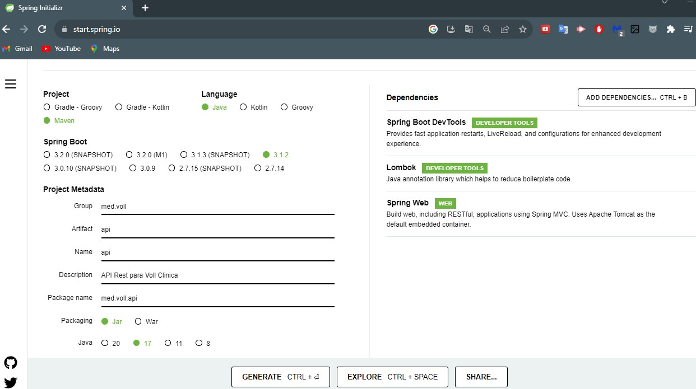
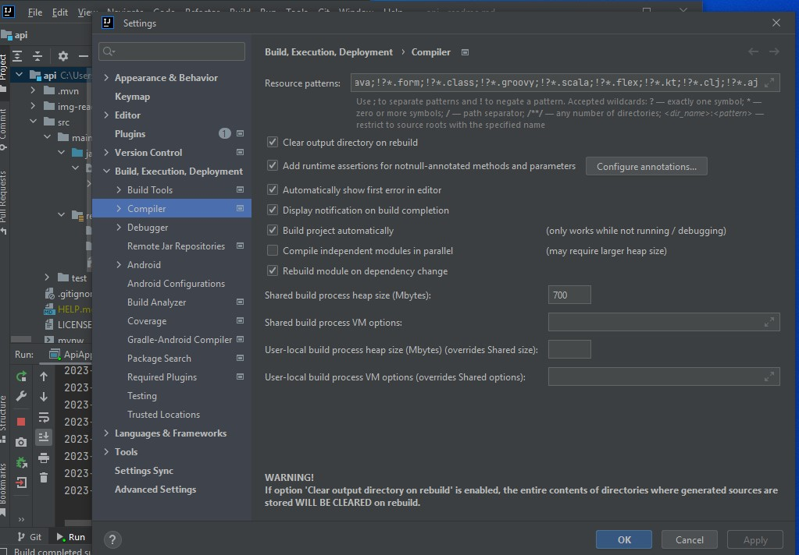
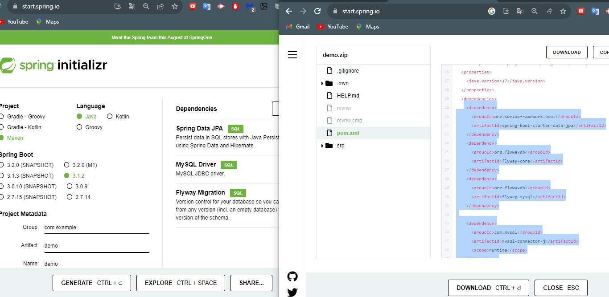

<h1 align="center"> Curso de Spring Boot 3 desarrollar una API Rest para una Clinica en Java</h1>

## Índice

* [Descripción del proyecto](#descripción-del-proyecto)
* [Tecnologías utilizadas](#tecnologías-utilizadas)
* [Desarrollo del proyecto](#Desarrollo)
* [Estado del proyecto](#estado-del-proyecto)

* [Características y demostración del Proyecto](#características-y-demostracion-Proyecto)

* [Acceso al proyecto](#acceso-proyecto)

* [Personas Contribuyentes](#personas-contribuyentes)

* [Licencia](#licencia)

* [Conclusión](#conclusión)


# Descripción del proyecto

- Realice este curso para Java y:
  - Cree una API Rest de Java desde cero con Spring Boot
  - Desarrolle CRUD usando la base de datos MySQL
  - Use Flyway como una herramienta de migración de API
  - Realizar validaciones usando Bean Validation
  - Realizar paginación de datos API

- Objetivos Creacion de una API Rest
  - CRUD (create, Read, Update, Delete)
  - Validaciones
  - Paginacion y orden

	
### Proyecto de una Clinica Medica.
Clínica médica - Nuestra Voll clinic. En una clínica médica intervienen muchas cosas: pacientes, doctores, consultas, historias clínicas, etc.
y hay interacciones interesantes entre estos, por ejemplo, un paciente puede tener muchos doctores así como un doctor puede tener muchos pacientes.

Este tipo de relaciones y mapeamientos lo vamos a ver con Hybernate, por ejemplo. Podemos listar las historias clínicas, podemos listar los pacientes, 
podemos registrar nuevos pacientes, etc.

# Tecnologías utilizadas
- Tecnologias
	- Spring Boot 3
	- Java 17
	- Lombok: (herramienta para ayudar a reducir codigo, autogenera getter and setters, constructorses, etc).
	- MySQL/Flyway: (Flyway es un gestor de base de datos a nivel de la estructura y las tablas, declarar tus tablas como Scribd de SQL y
	  el motor de Flyway lo ejecuta y va a crear tu estructura de datos en MySQL de tal forma que es mantenible en el futuro,
	  es versionable y bueno puedes habilitar colaboración entre muchos desarrolladores.)
	- JPA/Hibernate: (JPA es la especificación de Java para lo que es persistencia y Hibernate es la implementación de esta especificación.)
	- Maven: (Maven es un gestor de dependencias, al igual que Gradle. Con esto tú declaras tus dependencias en el archivo pom.xml,
	  y puedes controlar mejor las versiones, actualizar y no tienes que necesariamente tener el archivo jar y pegarlo en tu proyecto.)
	- Insomnia: (Para probar nuestra API).


# Desarrollo del proyecto
* Generando proyecto con Spring Initializr. https://start.spring.io/



* Dependencias. Qué cosas va usar nuestro proyecto externas a lo que tenemos (las que ya se eligieron como maven, java17 jara).
- Spring Boot DevTools: Nos da la facilidad de modificar nuestro código y no tener que reiniciar el servidor. Para que veamos los cambios en tiempo real.
- Lombok: Para reducir codigo.
- Spring Web: Que si bien no vamos hacer una aplicación web, pero Spring Web nos da las librerías que necesitamos para exponer nuestros métodos de API Rest a través de post, get, put, delete, etcétera.

### Java y sus Versiones:
Estamos utilizando Java 17 en este curso, sin embargo, generalmente Oracle sugiere instalar la versión más actual y no tiene problema usar la versión más reciente pues así evita los problemas de compatibilidad.

Además, puede instalar una versión Java y utilizar otra versión en el IDE de su máquina. Vamos a mostrar dos ejemplos de cómo cambiar la versión de Java en un proyecto.

#### - Un ejemplo con Intellij IDEA:

Seleccione la opción 'File' en el menú principal.
Seleccione 'Project Structure'.
En 'Project Settings' en la parte 'Project' seleccione la opción deseada de Java en 'SDK' Y seleccione Ok.
Recuerde que es posible añadir nuevas versiones y utilizar como desee

#### - Un ejemplo con Eclipse:

Seleccione el proyecto con el botón derecho y seleccione la opción ‘Properties’.
Seleccione la sección ‘Java Compiler’ y desmarque la opción de la parte ‘JDK Compliance’.
Después es posible cambiar la versión de Java en la parte ‘Compiler compliance level’.
Seleccione la sección ‘Java Compiler'y desmarque la opción de la parte ‘JDK Compliance’.- Después es posible cambiar la versión de Java en la parte ‘Compiler compliance level’.


## Que es Spring y Spring Boot

Spring y Spring Boot no son lo mismo con diferentes nombres.

Spring es un framework para desarrollar aplicaciones en Java, creado a mediados de 2002 por Rod Johnson, que se ha vuelto muy popular y adoptado en todo el mundo debido a su simplicidad y facilidad de integración con otras tecnologías.
El framework se desarrolló de forma modular, en el que cada recurso que proporciona está representado por un módulo, que se puede agregar a una aplicación según sea necesario. Con esto, en cada aplicación podemos agregar solo los módulos que tengan sentido, haciéndola así más liviana. Hay varios módulos en Spring, cada uno con un propósito diferente, tales como: el módulo MVC, para desarrollar aplicaciones Web y API's Rest; el módulo de Security, para manejar el control de autenticación y autorización de las aplicaciones; y el módulo Transactions, para gestionar el control transaccional.
Sin embargo, uno de los mayores problemas de las aplicaciones que usaban Spring era la parte de configuración de sus módulos, que se hacía íntegramente con archivos XML, y después de unos años el framework también comenzó a soportar configuraciones a través de clases Java, utilizando principalmente anotaciones. En ambos casos, dependiendo del tamaño y complejidad de la aplicación, así como de la cantidad de módulos Spring utilizados en ella, dichas configuraciones eran bastante extensas y difíciles de mantener.

Además, iniciar un nuevo proyecto con Spring era una tarea bastante complicada, debido a la necesidad de realizar este tipo de configuraciones en el proyecto.

Precisamente para solventar tales dificultades, a mediados de 2014 se creó un nuevo módulo Spring, denominado Boot, con el objetivo de agilizar la creación de un proyecto que utilice Spring como framework, así como simplificar las configuraciones de sus módulos.

El lanzamiento de Spring Boot fue un hito para el desarrollo de aplicaciones Java, ya que hizo más simple y ágil esta tarea, facilitando mucho la vida de las personas que utilizan el lenguaje Java para desarrollar sus aplicaciones.

- La versión 3 de Spring Boot se lanzó en noviembre de 2022 y trae algunas características nuevas en comparación con la versión anterior. Entre las principales novedades se encuentran:
  - Compatibilidad con Java 17
  - Migración de especificaciones Java EE a Jakarta EE
  - Compatibilidad con imágenes nativas
  - Puede ver la lista completa de las novedades de Spring Boot versión 3 en el sitio web: Spring Boot 3.0 Release Notes

#### Abrimos el proyecto en El Editor de codigo Intellij IDEA
- Clic en File --> Open --> Elegir api (archivoDescargado generado en Spring Initalizr) -> clic en Trust Project. y listo.

#### Revisamos los archivos del proyecto
- Archivo pom.xml:
  - Parent: el spring-boot-starter-parent, Nosotros no tenemos ninguna dependencia que sea, explícitamente Spring Boot como dependencia. ¿Dónde está Spring Boot? Bueno, Spring Boot viene del parent. El parent es como que el padre en el como que el padre de este pom. Por lo tanto al especificar el parent, Spring Boot, esto quiere decir van a heredar todas las características que existen en el pom de Spring Boot. Si hay alguna otra dependecia que quieras que herede a todo el proyecto se puede definir aqui.
  - Resources: En la parte de recursos o resources tenemos la carpeta static, que es para guardar archivos, JavaScript o .CSS para hojas de estilos en caso que estés creando una aplicación web. La parte de templates es para guardar todo lo que son páginas HTML.
  - application.properties: Es para almacenar propiedades del archivo. Por ejemplo, si tú quieres en tu código especificar una versión, alguna característica predeterminada nos puede ser útil crear en un archivo properties.

#### Ejecutamos el proyecto:
- Si no tenemos el modulo del proyecto con Java 17, Debemos actualizar el proyecto a Java 17.
  - Cambiar el proyecto a java 17: Seleccionar proyecto --> Clic en File --> Project Structure --> Clic en Project --> en SDK --> Seleccionar: Java17 --> clic en Apply y Aceptar.
    
- Configurar el proyecto para que pueda usar Devtools: con DevTools no deberíamos reiniciar la aplicación para que funcione.
  - Seleccionar el Proyecto --> Clic en file --> clic en Settings --> desplegar Build, Execution, Deployment --> Seleccionar Compiler --> y dar clic o seleccionar Build project automatically --> clic en Apply
    
  - luego buscar y clicar Advanced Settings: --> dar clic y Seleccionar Allow auto-make to start even if developed aplication is currently running: Clic en Aply y Ok.
    
  - Esto va a habilitar que nuestra aplicación recargue automáticamente apenas guardamos, sin que tengamos que reiniciar el servidor. Solo recargamos el navegador.

## Requests POST
### Enviando datos:
- Para las pruebas utilizaremos Insomnia por lo que debemos descargarla: https://insomnia.rest/download
- Utilizando Insomnia - Este es el cuerpo JSON que va a llegar o debería llegar a mi endpoint de médicos aquí en mi controller.
```
{
  "nombre": "Rodrigo Lopez",
  "email": "rodrigo.lopez@voll.med",
  "documento":"123456",
  "especialidad": "ortopedia",
  "direccion":{
  "calle": "calle 1",
  "distrito": "distrito 1",
  "ciudad": "lima",
  "numero": "1",
  "complemento": "a"
  }
  }
```
- El body que enviamos normalmente de request post, se llama payload

### Recibiendo datos:
- JSON (JavaScript Object Notation) es un formato utilizado para representar información, al igual que XML y CSV.
- Una API necesita recibir y devolver información en algún formato, que representa los recursos que administra. JSON es uno de estos posibles formatos, habiéndose popularizado por su ligereza, sencillez, facilidad de lectura por personas y máquinas, así como por su soporte para diferentes lenguajes de programación.
- Un ejemplo de representación de información en formato XML sería:
```
<producto>
    <nombre>Mochila</nombre>
    <precio>89.90</precio>
    <descripcion>Mochila para notebooks de hasta 17 pulgadas</descripcion>
</producto>
```

- La misma información podría representarse en formato JSON de la siguiente manera:
```
{
“nombre” : “Mochila”,
“precio” : 89.90,
“descripcion” : “Mochila para notebooks de hasta 17 pulgadas”
}
```
- Observe cómo el formato JSON es mucho más compacto y legible. Precisamente por eso, se ha convertido en el formato universal utilizado en la comunicación de aplicaciones, especialmente en el caso de las API REST.
- Se pueden encontrar más detalles sobre JSON en el sitio web JSON.org.

##### Tratando con CORS
Cuando desarrollamos una API y queremos que todos sus recursos estén disponibles para cualquier cliente HTTP, una de las cosas que nos viene a la mente es CORS (Cross-Origin Resource Sharing), en Español, “Intercambio de recursos con diferentes orígenes” Si aún no te ha pasado, no te preocupes, es normal tener errores de CORS al consumir y poner a disposición las APIs.

Pero al fin y al cabo, ¿qué es CORS, qué provoca errores y cómo evitarlos en nuestras APIs con Spring Boot?

##### CORS
CORS es un mecanismo utilizado para agregar encabezados HTTP que le indican a los navegadores que permitan que una aplicación web se ejecute en un origen y acceda a los recursos desde un origen diferente. Este tipo de acción se denomina cross-origin HTTP request. En la práctica, les dice a los navegadores si se puede acceder o no a un recurso en particular.

Pero, ¿por qué ocurren los errores? ¡Es hora de entender!

- Same-origin policy
Por defecto, una aplicación Front-end, escrita en JavaScript, solo puede acceder a los recursos ubicados en el mismo origen de la solicitud. Esto sucede debido a la política del mismo origen (same-origin policy), que es un mecanismo de seguridad de los navegadores que restringe la forma en que un documento o script de un origen interactúa con los recursos de otro. Esta política tiene como objetivo detener los ataques maliciosos.

- Dos URL comparten el mismo origen si el protocolo, el puerto (si se especifica) y el host son los mismos. Comparemos posibles variaciones considerando la URL https://cursos.alura.com.br/category/programacao:
  - URL		
  https://cursos.alura.com.br/category/front-end	
  - Resultado: Mismo origen	
  - Motivo: Solo camino diferente


Ahora, la pregunta sigue siendo: ¿qué hacer cuando necesitamos consumir una API con una URL diferente sin tener problemas con CORS? Como, por ejemplo, cuando queremos consumir una API que se ejecuta en el puerto 8000 desde una aplicación React que se ejecuta en el puerto 3000. ¡Compruébalo!
Al enviar una solicitud a una API de origen diferente, la API debe devolver un header llamado Access-Control-Allow-Origin. Dentro de ella es necesario informar los diferentes orígenes que serán permitidas de consumir la API, en nuestro caso: Access-Control-Allow-Origin: http://localhost:3000.
Puede permitir el acceso desde cualquier origen utilizando el símbolo * (asterisco): Access-Control-Allow-Origin: *. Pero esta no es una medida recomendada, ya que permite que fuentes desconocidas accedan al servidor, a menos que sea intencional, como en el caso de una API pública. Ahora veamos cómo hacer esto en Spring Boot correctamente.
##### Habilitación de diferentes orígenes en Spring Boot
- Para configurar el CORS y permitir que un origen específico consuma la API, simplemente cree una clase de configuración como la siguiente:
```
@Configuration
public class CorsConfiguration implements WebMvcConfigurer {

    @Override
    public void addCorsMappings(CorsRegistry registry) {
        registry.addMapping("/**")
            .allowedOrigins("http://localhost:3000")
            .allowedMethods("GET", "POST", "PUT", "DELETE", "OPTIONS", "HEAD", "TRACE", "CONNECT");
    }
}
```
http://localhost:3000 sería la dirección de la aplicación Front-end y .allowedMethods los métodos que se permitirán ejecutar. Con esto, podrás consumir tu API sin problemas desde una aplicación front-end.

##### DTO Java Record:
El patrón DTO, Data Transfer Object, que es básicamente usar a nivel de controller un objeto como intermediario para que mapee la información que nos llega desde nuestro cliente hacia nuestro API.

## 03 - Spring Data JPA(Java Persistence API)
#### Preparando el ambiente: MySQL
- Se utilizará MySQL como sistema de gestión de base de datos: Descargarlo de la pagina oficial https://www.mysql.com/

#### Agregando dependencias
- Utilizando Spring Initializr https://start.spring.io/ : Seleccionar Maven, Spring Boot version: 3.1.2 y buscar las siguientes dependencias, luego clic en Explore(para ver el proyecto que se genera) y Copiar las dependencias y pegarlas en el archivo pom.xml de nuestro proyecto y guardar o clic en el Boton de maven y clic en la rueda de refresh:
  - Spring Data JPA
  - MySQL Driver
  - Flyway Migration (Gestor de migracion de BD, Para mantener la BD como codigo versionado.)
    
- Otra forma de agrgegar las dependencias es por medio del Maven Repository (https://mvnrepository.com/) el cual el proceso es ir buscar la dependencia y pegarla en el archivo pom.xml del proyecto.
#### Conexion a la Base de Datos:
##### configurar un data source: 

- Ir a la carpeta de resources en el archivo application.properties: Aquí se necesita agregar tres properties para que pueda funcionar el springdata esta son: URL del dataSourse, el nombre del usuario, la contraseña del usuario.
```#Database:
#url+direccion(localhost)+puerto(3306)+vollmed_api(nombre de la BD)
spring.datasource.url=jdbc:mysql://localhost:3306/vollmed_api
spring.datasource.username=root  
spring.datasource.password=admin  
```
##### Crear la Base de datos en MySQL(usando workbeanch)
- Utilize el comando:
```
  create database vollmed_api;
  use vollmed_api;
```
- Luego ejecute la aplicacion de springBoot deberá correr.
##### Para saber más: ¿Archivo properties o yaml?
- La configuración de una aplicación Spring Boot se realiza en archivos externos, y podemos usar el archivo de propiedades o el archivo YAML. En este “Para saber más”, abordaremos las principales diferencias entre ellos.

###### Archivo de propiedades
De forma predeterminada, Spring Boot accede a las configuraciones definidas en el archivo application.properties, que utiliza un formato clave=valor:
```
spring.datasource.driver-class-name=com.mysql.cj.jdbc.Driver
spring.datasource.url=jdbc:mysql://localhost:3306/clinica
spring.datasource.username=root
spring.datasource.password=root
```
Cada fila es una configuración única, por lo que necesitamos expresar datos jerárquicos usando los mismos prefijos para nuestras claves, es decir, necesitamos repetir los prefijos, en este caso spring y datasource.

###### Configuración YAML
- YAML es otro formato muy utilizado para definir datos de configuración jerárquicos, como se hace en Spring Boot.
- Tomando el mismo ejemplo de nuestro archivo application.properties, podemos convertirlo a YAML cambiando su nombre a application.yml y modificando su contenido a:
```
spring:
datasource:
driver-class-name: com.mysql.cj.jdbc.Driver
url: jdbc:mysql://localhost:3306/clinica
username: root
password: root
```
- Con YAML, la configuración se ha vuelto más legible ya que no contiene prefijos repetitivos. Además de la legibilidad y la reducción de repeticiones, el uso de YAML facilita el almacenamiento de variables de configuración del entorno, como lo recomienda 12 Factor App, https://12factor.net/es/ una metodología conocida y utilizada que define 12 mejores prácticas para crear una aplicación moderna, escalable y de sencillo mantenimiento.

###### Pero después de todo, ¿qué formato usar?
- A pesar de las ventajas que nos aportan los archivos YAML frente al archivo properties, la decisión de elegir uno u otro es una cuestión de gusto personal. Además, no se recomienda tener ambos tipos de archivos en el mismo proyecto al mismo tiempo, ya que esto puede generar problemas inesperados en la aplicación.
- Si elige usar YAML, tenga en cuenta que escribirlo al principio puede ser un poco laborioso debido a sus reglas de tabulación.

#### Entidades JPA


# Estado del proyecto
<p>
   
</p>

# Personas Contribuyentes
## Autores

| [<br><sub>Gerson Escobedo</sub>](https://github.com/gerson121295)

# Licencia


License: [MIT](License.txt)

# Personas Desarrolladores del Proyecto


# Conclusión


