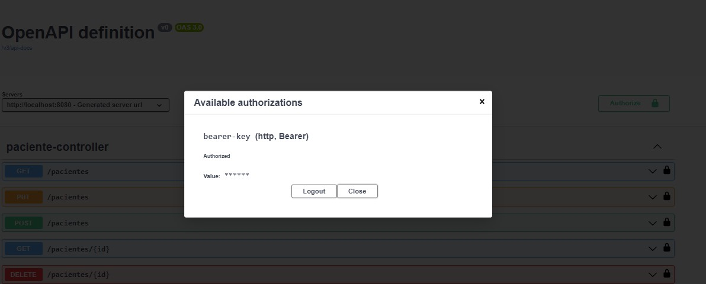

<h1 align="center"> Curso de Spring Boot 3: documentar, probar y preparar una API para su implementación</h1>

## Índice

* [Descripción del proyecto](#descripción-del-proyecto)
* [Tecnologías utilizadas](#tecnologías-utilizadas)
* [Desarrollo del proyecto](#Desarrollo)
* [Estado del proyecto](#estado-del-proyecto)

* [Características y demostración del Proyecto](#características-y-demostracion-Proyecto)

* [Acceso al proyecto](#acceso-proyecto)

* [Personas Contribuyentes](#personas-contribuyentes)

* [Licencia](#licencia)

* [Conclusión](#conclusión)

# Descripción del proyecto
# Curso de Spring Boot 3: documentar, probar y preparar una API para su implementación - API Clinica v3
Este curso es ideal para desarrollar API´s basadas en un framework de inversion de control para plataforma en JAVA permitiendo agilizar el desarrollo y enfocar en las reglas de negocio del proyecto.

- Aprenda a aislar código de reglas de negocio en una aplicación
- Implemente princípios SOLID
- Documente una API seguindo el protocolo OpenAPI
- Aprenda a escribir pruebas automatizadas en una aplicación con Spring Boot
- Realize el build de una aplicação con Spring Boot
- Use variables de entorno/ambiente y prepare una aplicación para su implementación/deploy

## Clases: 
- 01: Agendamiento de consultas.
- 02: Reglas de negocio.
- 03: Documentación de la API.
- 04: Tests automatizados.
- 05: Build del proyecto.

### Proyecto de una Clinica Medica.
Clínica médica - Nuestra Voll clinic. En una clínica médica intervienen muchas cosas: pacientes, doctores, consultas, historias clínicas, etc.
y hay interacciones interesantes entre estos, por ejemplo, un paciente puede tener muchos doctores así como un doctor puede tener muchos pacientes.

Este tipo de relaciones y mapeamientos lo vamos a ver con Hybernate, por ejemplo. Podemos listar las historias clínicas, podemos listar los pacientes, 
podemos registrar nuevos pacientes, etc.


# Tecnologías utilizadas
- Tecnologias
	- Spring Boot 3
	- Java 17
	- Lombok: (herramienta para ayudar a reducir codigo, autogenera getter and setters, constructorses, etc).
	- MySQL/Flyway: (Flyway es un gestor de base de datos a nivel de la estructura y las tablas, declarar tus tablas como Scribd de SQL y
	  el motor de Flyway lo ejecuta y va a crear tu estructura de datos en MySQL de tal forma que es mantenible en el futuro,
	  es versionable y bueno puedes habilitar colaboración entre muchos desarrolladores.)
	- JPA/Hibernate: (JPA es la especificación de Java para lo que es persistencia y Hibernate es la implementación de esta especificación.)
	- Maven: (Maven es un gestor de dependencias, al igual que Gradle. Con esto tú declaras tus dependencias en el archivo pom.xml,
	  y puedes controlar mejor las versiones, actualizar y no tienes que necesariamente tener el archivo jar y pegarlo en tu proyecto.)
	- Insomnia: (Para probar nuestra API).

### Reglas de Negocio: Requerimientos

#### Request POST - Registrar Medicos
- Registrar médico con los siguientes datos:
```json
{
	"nombre": "Gerson Ep",
	"email": "Gerson.ep@voll.med",
	"documento":"881114",
	"telefono":"51656222",
	"especialidad": "ORTOPEDIA",
	"direccion":{
		"calle": "calle 6",
		"distrito": "distrito 6",
		"ciudad": "Lima",
		"numero": "1",
		"complemento": "e"
	}
}
```
#### Request GET - Produciendo Datos
- Consideraciones:
  - Informacion Requerida del medico: Nombre, Especialidad, Documento y Email.
  - Reglas de negocio: Ordenado ascendentemente, paginado, maximo 10 registros por paginas.

#### Request PUT - Actualizacion de Médicos
- Se solicita:
  - Informacion permitida para actualizacion: Nombre, Documento y Direccion.
  - Reglas de negocio: No permitir actualizar email, especialidad y documento.

#### Request DELETE - Exclusion de Médicos
- Reglas de Negocio:
  - El registro no debe ser borrado de la base de datos.
  - El listado debe retornar solo médicos activos.
- Los medicos no deben ser borrados de la BD, por lo que se realizar un delete logico. Se quiere que el médico quede desactivado a nivel de BD, por lo que no se debe eliminar, para resolverlo
debemos crear un campo flag(bandera) llamado activo en la tabla medico, al instanciarse cada medico en activo sera = 1, al eliminar el medico activo será = 0, al hacer el listado solo se retornarán los medicos
activos donde Activo es = 1. Y asi los registro medicos no se eliminarán de la BD. Ya que obviamente siempre es bueno mantener un histórico, qué médicos han trabajado en la clinica.

## Desarrollo del proyecto
* Generando proyecto con Spring Initializr. https://start.spring.io/


## Resultados 
- Para Ejecutar un método exitosamente necesitaremos enviar el token generado del login.
- Método Post: Enviamos login y clave y al logearse se obtiene el token el cual será necesario para ejecutar exitosamente los metodos.
  
- 

- Método Mostrar registro de Medicos - Método Get sin Token: no permite mostrar los registros medicos.


- Método Mostrar registro de Medicos - Método Get con Token: Permite mostrar los registros medicos.  Debemos elegir la autenticacion Bearer y en la opcion token pegar el token generado en el login. 
  

- Método Eliminar un Registro Médico - Método DELETE sin Token no permite eliminar el registro médico.
  

- Método Eliminar un Registro Médico - Método DELETE con Token Permite eliminar el registro médico.
  

- Revisar y Descargar Codigo del Proyecto Anterior -  API Rest Clinica v2:
  - https://github.com/alura-es-cursos/1979-spring-boot-buenas-practicas-security/tree/clase-5
  - https://github.com/Gerson121295/SpringBoot3MejoresPracticasYProtejaAPIRestClinica2
  - Presentaciones: https://drive.google.com/drive/folders/1eNnXuuPuxIi70toLvNzjDG2Joet70Kt7

## Curso de Spring Boot 3: documentar, probar y preparar una API para su implementación - API Clinica v3

### 01 - Agendamientos de consultas
#### Anotacion @JsonAlias

- Los nombres de los campos enviados en JSON a la API deben ser idénticos a los nombres de los atributos de las clases DTO, ya que de esta manera Spring puede completar correctamente la información recibida.
- Sin embargo, puede ocurrir que un campo se envíe en JSON con un nombre diferente al atributo definido en la clase DTO. Por ejemplo, imagine que se envíe el siguiente JSON a la API:

```json
{
"producto_id": 12,
"fecha_compra": "01/01/2022"
}
```
- Y la clase DTO creada para recibir esta información se define de la siguiente manera:
```java
public record DatosCompra(Long idProducto, LocalDate fechaCompra){}
```
- Si esto ocurre, tendremos problemas porque Spring instanciará un objeto del tipo DatosCompra, pero sus atributos no se completarán y quedarán como null debido a que sus nombres son diferentes a los nombres de los campos recibidos en JSON.
- Tenemos dos posibles soluciones para esta situación:
  1. Renombrar los atributos en el DTO para que tengan el mismo nombre que los campos en JSON;
  2. Solicitar que la aplicación cliente que envía las solicitudes a la API cambie los nombres de los campos en el JSON enviado.
- La primera opción anteriormente mencionada no es recomendable, ya que los nombres de los campos en JSON no están de acuerdo con el estándar de nomenclatura de atributos utilizado en el lenguaje Java.
- La segunda opción sería la más indicada, pero no siempre será posible "obligar" a los clientes de la API a cambiar el estándar de nomenclatura utilizado en los nombres de los campos en JSON.
- Para esta situación, existe una tercera opción en la que ninguno de los lados (cliente y API) necesita cambiar los nombres de los campos/atributos. Para ello, solo es necesario utilizar la anotación @JsonAlias:

```java
public record DatosCompra(
@JsonAlias("producto_id") Long idProducto,
@JsonAlias("fecha_compra") LocalDate fechaCompra
){}
La anotación @JsonAlias sirve para mapear "alias" alternativos para los campos que se recibirán del JSON, y es posible asignar múltiples alias:
public record DatosCompra(
@JsonAlias({"producto_id", "id_producto"}) Long idProducto,
@JsonAlias({"fecha_compra", "fecha"}) LocalDate fechaCompra
){}
```
- De esta manera, se resuelve el problema, ya que Spring, al recibir el JSON en la solicitud, buscará los campos considerando todos los alias declarados en la anotación @JsonAlias.

#### Dar Formato a las fechas
- Como se demostró en el video anterior, Spring tiene un patrón de formato para campos de tipo fecha cuando se asignan a atributos de tipo LocalDateTime. Sin embargo, es posible personalizar este patrón para utilizar otros formatos que prefiramos.
- Por ejemplo, imagine que necesitamos recibir la fecha/hora de la consulta en el siguiente formato: dd/mm/yyyy hh:mm. Para que esto sea posible, debemos indicar a Spring que este será el formato en el que se recibirá la fecha/hora en la API, lo que puede hacerse directamente en el DTO utilizando la anotación @JsonFormat:

```java
@NotNull
@Future
@JsonFormat(pattern = "dd/MM/yyyy HH:mm")
LocalDateTime data
```
- En el atributo pattern indicamos el patrón de formato esperado, siguiendo las reglas definidas por el estándar de fechas de Java. Puede encontrar más detalles en esta página del JavaDoc.
- Esta anotación también se puede utilizar en las clases DTO que representan la información que devuelve la API, para que el JSON devuelto se formatee de acuerdo con el patrón configurado. Además, no se limita solo a la clase LocalDateTime, sino que también se puede utilizar en atributos de tipo LocalDate y LocalTime.

#### Service Pattern
- El patrón Service es muy utilizado en la programación y su nombre es muy conocido. Pero a pesar de ser un nombre único, Service puede ser interpretado de varias maneras: puede ser un caso de uso (Application Service); un Domain Service, que tiene reglas de su dominio; un Infrastructure Service, que utiliza algún paquete externo para realizar tareas; etc.
- A pesar de que la interpretación puede ocurrir de varias formas, la idea detrás del patrón es separar las reglas de negocio, las reglas de la aplicación y las reglas de presentación para que puedan ser fácilmente probadas y reutilizadas en otras partes del sistema.
- Existen dos formas más utilizadas para crear Services. Puede crear Services más genéricos, responsables de todas las asignaciones de un Controller; o ser aún más específico, aplicando así la S del SOLID: Single Responsibility Principle (Principio de Responsabilidad Única). Este principio nos dice que una clase/función/archivo debe tener sólo una única responsabilidad.
- Piense en un sistema de ventas, en el que probablemente tendríamos algunas funciones como: Registrar usuario, Iniciar sesión, Buscar productos, Buscar producto por nombre, etc. Entonces, podríamos crear los siguientes Services: RegistroDeUsuarioService, IniciarSesionService, BusquedaDeProductosService, etc.
- Pero es importante estar atentos, ya que muchas veces no es necesario crear un Service y, por lo tanto, agregar otra capa y complejidad innecesarias a nuestra aplicación. Una regla que podemos utilizar es la siguiente: si no hay reglas de negocio, simplemente podemos realizar la comunicación directa entre los controllers y los repositories de la aplicación.

### Códigos para nuevas funcionalidades
- Para implementar esta o cualesquiera otras funcionalidades, seguimos una especie de paso a paso. Necesitamos crear siempre los siguientes tipos de códigos:
  - Controller, para mapear la solicitud de la nueva funcionalidad;
  - DTOs, que representan los datos que llegan y salen de la API;
  - Entidad JPA;
  - Repository, para aislar el acceso a la base de datos;
  - Migration, para hacer las alteraciones en la base de datos.
- Estos son los cinco tipos de código que siempre desarrollaremos para una nueva funcionalidad. Esto también se aplica al agendamiento de las consultas, incluyendo un sexto elemento a la lista, las reglas de negocio. En esta clase, entenderemos cómo implementar las reglas de negocio con algoritmos más complejos.

- La clase de consultaController, es la clase encargada de comunicarse con las API externas, recibir la información y guardarla en la base de datos.
- Tenemos algunas reglas que deben cumplirse, entonces nosotros tenemos que validar que ese ID existiera en la BD y tenemos que validar otras reglas de negocio, por lo que se construyo una clase de servicio para evitar colocar todas esas responsabilidades dentro de la clase controlador, ya que es la responsabilidad de la clase controlador únicamente comunicarse con APIs externas.
La clase de servicio la responsabilidad de ella va a ser procesar esa información para poder posteriormente enviarla al repositorio y guardar esa información en la base de datos.

## 02 - Reglas de Negocio
###  Principios SOLID
- SOLID es un acrónimo que representa cinco principios de programación:
  - Principio de Responsabilidad Única (Single Responsibility Principle)
  - Principio Abierto-Cerrado (Open-Closed Principle)
  - Principio de Sustitución de Liskov (Liskov Substitution Principle)
  - Principio de Segregación de Interfaces (Interface Segregation Principle)
  - Principio de Inversión de Dependencia (Dependency Inversion Principle)
- Cada principio representa una buena práctica de programación que, cuando se aplica en una aplicación, facilita mucho su mantenimiento y extensión. Estos principios fueron creados por Robert Martin, conocido como Uncle Bob, en su artículo Design Principles and Design Patterns.

## 03 - Documentacion de la API
### Documentando con SpringDoc
#### OpenAPI Initiative
- La documentación es algo muy importante en un proyecto, especialmente si se trata de una API Rest, ya que en este caso podemos tener varios clientes que necesiten comunicarse con ella y necesiten documentación que les enseñe cómo realizar esta comunicación de manera correcta.
- Durante mucho tiempo no existió un formato estándar para documentar una API Rest, hasta que en 2010 surgió un proyecto conocido como Swagger, cuyo objetivo era ser una especificación open source para el diseño de APIs Rest. Después de un tiempo, se desarrollaron algunas herramientas para ayudar a los desarrolladores a implementar, visualizar y probar sus APIs, como Swagger UI, Swagger Editor y Swagger Codegen, lo que lo convirtió en un proyecto muy popular y utilizado en todo el mundo.
- En 2015, Swagger fue comprado por la empresa SmartBear Software, que donó la parte de la especificación a la fundación Linux. A su vez, la fundación renombró el proyecto a OpenAPI. Después de esto, se creó la OpenAPI Initiative, una organización centrada en el desarrollo y la evolución de la especificación OpenAPI de manera abierta y transparente.
- OpenAPI es actualmente la especificación más utilizada y también la principal para documentar una API Rest. La documentación sigue un patrón que puede ser descrito en formato YAML o JSON, lo que facilita la creación de herramientas que puedan leer dichos archivos y automatizar la creación de documentación, así como la generación de código para el consumo de una API.

- OpenAPI: especificamente OpenAPI Spring doc https://springdoc.org/ es una API que se integra en nuestro proyecto y al ejecutarlo permite al usuario o al cliente tener una APP como postman o Insomnia.
Esta API nos va a permitir crear una documentación interactiva dentro de nuestro proyecto, que va a permitirle al cliente conseguir trabajar con los endpoints y darle una mejor ilustración de los parámetros que se están aplicando.
- Para agregar la documentacion agregamos la dependencia de springdoc al archivo pom.xml.
```xml
<dependency>
      <groupId>org.springdoc</groupId>
      <artifactId>springdoc-openapi-starter-webmvc-ui</artifactId>
      <version>2.2.0</version>
</dependency>
```
- Luego de agregar la dependencia, This will automatically deploy swagger-ui to a spring-boot application:
  - Documentation will be available in HTML format, using the official swagger-ui jars
  - The Swagger UI page will then be available at http://server:port/context-path/swagger-ui.html and the OpenAPI description will be available at the following url for json format: http://server:port/context-path/v3/api-docs
- Estas urls se configuran en la clase securityConfigurations para permitir el acceso a las paginas.
 ```java
    .requestMatchers("/swagger-ui.html", "/v3/api-docs/**","/swagger-ui/**").permitAll()
```
- Luego de configurlo: Ir al navegador Chrome a la ruta para ver la documentacion: http://localhost:8080/v3/api-docs  para una mejor visualizacion de la data en objetos JSON se deberá descargar la extension: JSON Formatter. (O buscar como 2 opcion: Json Beautifier).
- Entonces en ese archivo JSON, vamos a encontrar todos los récords, todas las clases que nosotros estamos enviando dentro de la API de Postman, aquí vemos que nos indica el tipo que tenemos que pasar.
Y también tenemos los endpoints, tanto para pacientes, médicos, el login del token, consultas, pacientes por ID, médicos por ID, el Hello World, tenemos el servidor donde está corriendo, que es el puerto 8080 o cualquier otro servidor que estemos ejecutando dentro de esa aplicación, informaciones extras de api-doc.


- Luego vamos a entrar a la interfaz de usuario de Swagger a travez de la siguiente enlace: http://localhost:8080/swagger-ui/index.html  vemos que tenemos una interfaz de usuario realizada en HTML donde vamos a encontrar todos los endpoints para los controladores que nosotros realizamos.
  

- Para poder interactuar con los endpoints de los controladores generados por swagger debemos logearnos en login y copiar el toke y pasarlo a las demas controladores para consultar o registrar pacientes, medicos o consulta y para eso se debe pasar el token, por lo que debemos configurarlo para que estos metodos permitan recibie el token en swagger 
por lo que configuramos en nuestra app. en nuestra clase.

#### 13.34. How do I add authorization header in requests?

- You should add the @SecurityRequirement tags to your protected APIs.
- For example:

```java

@Operation(security = { @SecurityRequirement(name = "bearer-key") })  //Este codigo va en los controladores que lo necesiten, excepto AutenticacionController este no lo necesita ya que se le da acceso desde el control de seguridad.

//And the security definition sample:  //Este Bean va en la clase SpringDocConfigurations
@Bean
public OpenAPI customOpenAPI() {
        return new OpenAPI()
        .components(new Components()
        .addSecuritySchemes("bearer-key",
        new SecurityScheme().type(SecurityScheme.Type.HTTP).scheme("bearer").bearerFormat("JWT")));
        }
        
```
- En la documentación de Spring-doc, llegamos a la parte de beare(buscar en la lupa), encontramos que para agregar una autorización en el encabezado de nuestras peticiones, tenemos que agregar un método del tipo bean, colocar la anotación bean para ejecutar ese método de forma automática dentro del contexto de Spring framework. 
Así como colocar la anotación de requerimientos de seguridad dentro de todos los controladores que vayan a tener acceso a ese token. Entonces, lo primero sería colocar, copiar ese método. Vamos a ir de vuelta a nuestra API y en el paquete de infra de infraestructura se agrega un nuevo paquete llamado springdoc que va a ser todo lo relacionado a la documentación.
- Ese paquete springdoc y dentro de el vamos a crear la clase SpringDocConfigurations dentro de esta clase, nosotros vamos a agregar ese bean que estamos copiando.

- Luego de haber configurado
- Logearse: para recibir el Token para poder tener acceso a los metodos y acceder a los datos.
- Ir a autenticacion-controller --> En el metodo POST /login clic en try it out: luego escribir el login y la clave.


- Copiar el token y Vemos que esta vez nosotros tenemos un campo Available authorizations que nos va a permitir colocar ese token de autorización, entonces acá nos indica que tenemos que colocar el valor.
- Y una vez que nosotros seleccionamos autorizar, ese valor va a quedar guardado dentro de la interfaz de usuario en cuanto se esté ejecutando la aplicación, y clic en cerrar.




- Vamos a obtener el listado de pacientes, le damos a seleccionar acá try out. Y vamos a colocar acá ejecutar.
  

#### personalizando la documentación
- Ademas personalizar la documentación generada por SpringDoc para incluir el token de autenticación. Además del token, podemos incluir otras informaciones en la documentación que forman parte de la especificación OpenAPI, como la descripción de la API, información de contacto y su licencia de uso.
Estas configuraciones se deben hacer en el objeto OpenAPI, que se configuró en la clase SpringDocConfigurations de nuestro proyecto:

```java
@Bean
public OpenAPI customOpenAPI() {
return new OpenAPI()
.components(new Components()
.addSecuritySchemes("bearer-key",
new SecurityScheme()
.type(SecurityScheme.Type.HTTP)
.scheme("bearer")
.bearerFormat("JWT")))
.info(new Info()
.title("API Voll.med")
.description("API Rest de la aplicación Voll.med, que contiene las funcionalidades de CRUD de médicos y pacientes, así como programación y cancelación de consultas.")
.contact(new Contact()
.name("Equipo Backend")
.email("backend@voll.med"))
.license(new License()
.name("Apache 2.0")
.url("http://voll.med/api/licencia")));  }
```
- Las ventajas de generar una documentación automatizada de una API Rest.
  - Facilidad para que los clientes se integren a ella.
    - La documentación facilita mucho la vida de quienes desean integrarse a una API Rest, ya que expone sus funcionalidades y cómo deben ser consumidas.
  - Posibilidad de probar la API.
    - La documentación generada siguiendo el estándar OpenAPI permite que herramientas como Swagger UI se puedan utilizar para probar la API.

## 04-Tests automatizados
### Testes con Spring Boot


- Codigo del Proyecto Actual:
  - https://github.com/alura-es-cursos/Spring-Boot-3/tree/stage-1
- Enlaces donde podemos encontrar el soporte visual de la aplicación mobile front end y las diferentes actividades que fueron realizadas:
  - Aplicación mobile Front End:https://www.figma.com/file/vgn35i1ErivIN8LJYEqxGZ/Untitled?type=design&node-id=0-1&mode=design&t=0KPDVGatVlzK13xz-0
  - Solicitud del cliente para la API: https://trello.com/b/yGQuuyVV/api-voll-med
  
    
    

# Estado del proyecto
<p>
   
</p>

# Personas Contribuyentes
## Autores

| [<br><sub>Gerson Escobedo</sub>](https://github.com/gerson121295)

# Licencia


License: [MIT](License.txt)

# Personas Desarrolladores del Proyecto


# Conclusión
Excelente curso para aprender SpringBoot Security.


